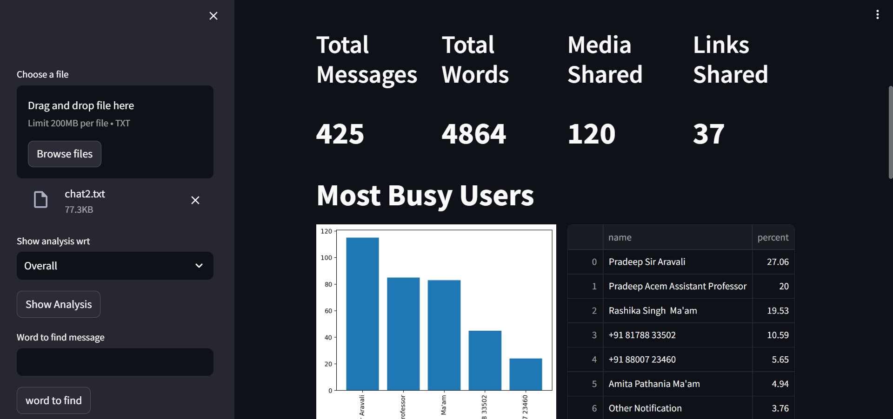

# WhatsApp Chat Analyzer

WhatsApp Chat Analyzer is a Streamlit application that provides detailed analysis of WhatsApp chat data. It includes various features such as total messages, total words, media shared, links shared, wordcloud, most common words, percentage of users in the chat, and group chat analysis.

## Link 

Site Link : https://whatsapp-chat-analyser-dh2znevjmqngbjyvzfc3m2.streamlit.app/

## Features

- **Total Messages**: Count the total number of messages in the chat.
- **Total Words**: Count the total number of words in the chat.
- **Media Shared**: Count the number of media files shared in the chat.
- **Links Shared**: Count the number of links shared in the chat.
- **Wordcloud**: Generate a wordcloud of the most common words in the chat.
- **Most Common Words**: List the most frequently used words in the chat.
- **Percentage of Users**: Calculate the percentage contribution of each user in the chat.
- **Group Chat Analysis**: Analyze group chats separately.

## Example





## Installation

1. Clone the repository:
    ```bash
    git clone https://github.com/your-username/whatsapp-chat-analyzer.git
    cd whatsapp-chat-analyzer
    ```

2. Install the required packages:
    ```bash
    pip install -r requirements.txt
    ```

## Usage

1. Export your WhatsApp chat as a text file.
2. Run the Streamlit application:
    ```bash
    streamlit run app.py
    ```
3. Upload your exported WhatsApp chat file on the web interface.
4. Explore the various analytics provided by the application.

## Contributing

Contributions are welcome! Please open an issue or submit a pull request.

## Contact

If you have any questions or suggestions, feel free to reach out to me at [bannubannu882@gmail.com].

